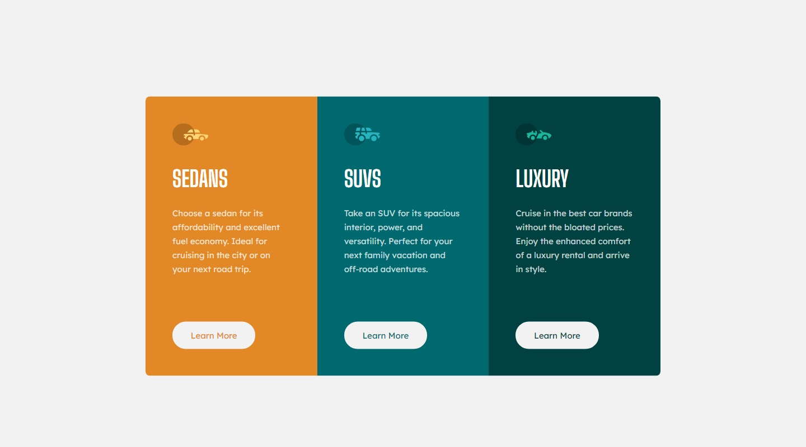
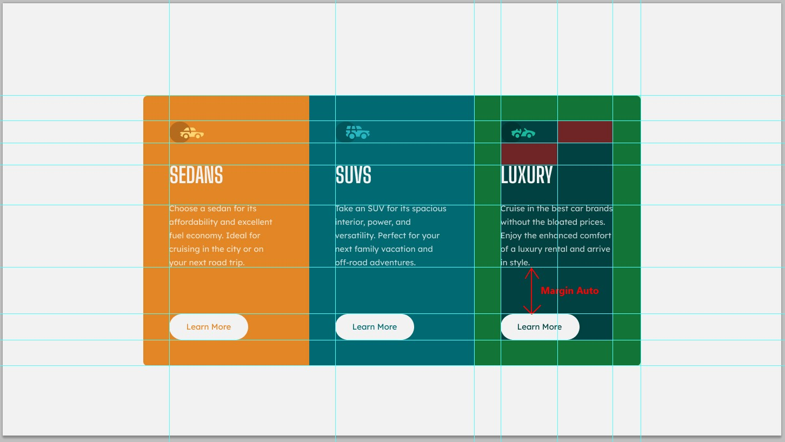
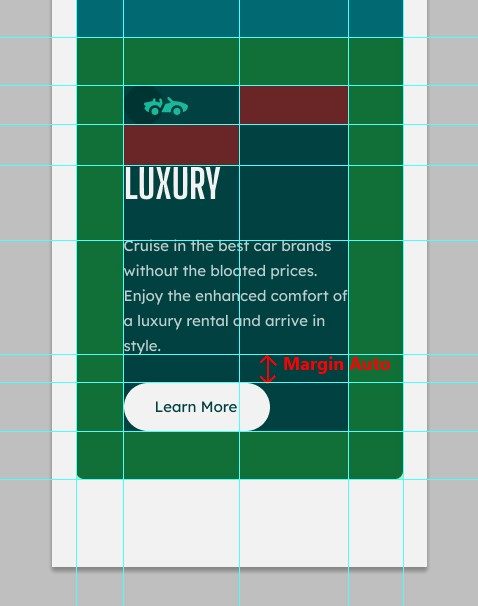

# Frontend Mentor - 3-column preview card component

A solution provide by jefflangtech [3-column preview card component challenge on Frontend Mentor](https://www.frontendmentor.io/challenges/3column-preview-card-component-pH92eAR2-).

## Table of contents

- [Overview](#overview)
  - [The challenge](#the-challenge)
  - [Screenshot](#screenshot)
  - [Links](#links)
- [My process](#my-process)
  - [Built with](#built-with)
  - [Step by step](#step-by-step)
  - [Continued development](#continued-development)
  - [Useful resources](#useful-resources)
- [Author](#author)

## Overview

### The challenge

Users should be able to:

- View the optimal layout depending on their device's screen size
- See hover states for interactive elements

### Screenshot

### Links

- Solution URL: [https://www.frontendmentor.io/solutions/three-column-preview-card-dPGlXJac1X](https://www.frontendmentor.io/solutions/three-column-preview-card-dPGlXJac1X)
- Live Site URL: [https://jefflangtech.github.io/three-column-preview/](https://jefflangtech.github.io/three-column-preview/)

## My process

### Built with

- Semantic HTML5 markup
- CSS custom properties
- Flexbox
- CSS Grid

### Step by step

This is a pretty straight-forward design, nice and simple, but also using a card container kind of layout that is seen frequently. I really wanted to focus on identifying the patterns in the layout and simplifying the CSS rules, even across media queries, and I'm pretty happy with how things turned out. I ended up with 165 lines of CSS, including leaving in the rules for testing purposes and all the organizational comments.

Total time: 5:02

1. Project plan (0:39)
2. Layout notes (0:49)
3. Setup design system (1:03)
4. HTML structure and preliminary validation tests (0:21)
5. Style desktop layout (1:05)
6. Style mobile layout & media queries (0:38)
7. Final updates & readme (0:25)

**Notes**
In addition to dropping the designs into photoshop and annotating them in my own way, I also decided to create a Google doc to take notes while I was working through the layouts. 

The challenges I gave myself with this one were as follows (in addition to the CSS minimalism):
- Code the buttons so they can be dropped onto any background color and will take on the color of the background...technically they don't take on the color of the background but they do inherit the color of the card. The other text content of the card has its own color(s) anyways.
- Float the mobile version without too many extra rules...I still think there must be a more elegant way of doing it but I'm satisfied.
- Use a minmax to control the card widths across the views - success!
- Incorporate ems - used for both the icon and header margins

### Continued development

This was great practice of preparation before coding. The project itself went quickly and that was helpful since I didn't have time to get distracted, or lost on a particularly difficult problem, and then lose my mental momentum. 

The next steps would be: 1. more practice, 2. more practice on more difficult layouts while still maintaining good procedures and achieving good results.

### Useful resources

- [Kevin Powell](https://www.youtube.com/@KevinPowell) - Gotta thank Kevin Powell again for the idea of marking up the design before beginning to code. He said he draws on paper printouts, which does sound nice--I would like to save more trees though--so he was using paint and I found using photoshop works great. The only difficulty is making text notes, which is why I incorporated the google doc alongside this time.

## Author

- Website - [JeffLangTech](https://jefflangtech.github.io/)
- Frontend Mentor - [@jefflangtech](https://www.frontendmentor.io/profile/jefflangtech)